# ETA Model Lifecycle

```mermaid
graph LR
    A["Data Collection<br/>(events_2025_01.parquet)"] -->|dataset_hash: sha256| B["Experimentation<br/>(local notebooks)"]
    B -->|git_sha, params.yaml| C["Training Run<br/>(run_id: uuid)"]
    C -->|model_uri: s3://models/eta/run_uuid| D["Evaluation<br/>(frozen test set)"]
    D -->|metrics: F1, P95_latency| E["Registry: Staging<br/>(auto-promoted)"]
    E -->|approval required| F["Registry: Production<br/>(versioned)"]
    F -->|model_version: v1.2.3| G["Canary Deployment<br/>(10% traffic)"]
    G -->|traffic_metrics| H["Full Deployment<br/>(100% traffic)"]
    H -->|predictions, latency| I["Monitoring<br/>(drift, SLA)"]
    I -->|drift_signal, retraining_trigger| J["Data Issues Report<br/>(slice analysis)"]
    J -->|feedback loop| A
    
    style E fill:#fff4e6
    style F fill:#e6f3ff
    style H fill:#e6ffe6
    style I fill:#ffe6f3
    
    D -->|metrics < threshold| K["Registry: Archived<br/>(manual)"]
    
    L["Monitoring Gates"] -->|P95 > 200ms or drift > 0.05| M["Alert & Rollback"]
```

## Lifecycle Details

| Stage | Input Artifact | Output Artifact | Approval Required | Automatic |
|-------|---|---|---|---|
| Data Collection | Raw events | `events_2025_01.parquet` (hash) | - | Hourly |
| Experimentation | Dataset hash | `params.yaml`, notebook run ID | - | Manual |
| Training | Code (git_sha), data (hash), params | Model checkpoint `s3://models/eta/{run_uuid}` | - | Triggered by push |
| Evaluation | Model checkpoint | Metrics JSON (F1, precision per-city, P95_latency_ms) | - | Automatic |
| Staging (Registry) | Metrics JSON | Staging model URI | - | Automatic if F1≥0.82, per-city F1≥0.70 |
| Production (Registry) | Staging model | Production model v{major.minor.patch} | ML Lead + Ops Lead | Manual approval |
| Canary Deploy | Production model | Traffic split config (10%) + latency SLI | - | Automatic |
| Full Deploy | Canary metrics | 100% traffic | Ops Lead | Auto if P95 < 150ms stable 1hr |
| Monitoring | Predictions stream | Drift score, slice metrics, latency percentiles | - | Continuous |
| Archived (Registry) | Production model | Archived URI + deprecation timestamp | ML Lead | Manual when replaced |

## Feedback Loops

- **Monitoring → Data**: Drift signal or SLA breach triggers investigation. If data issue detected (e.g., new courier region, changed dispatch rules), triggers retraining cycle.
- **Evaluation → Staging**: Only advances if gates pass. Failed evaluations remain in Training stage and trigger code review.
- **Production Rollback**: P95 latency > 200ms or drift magnitude > 0.05 for 15 min → automated rollback to previous Production version.
